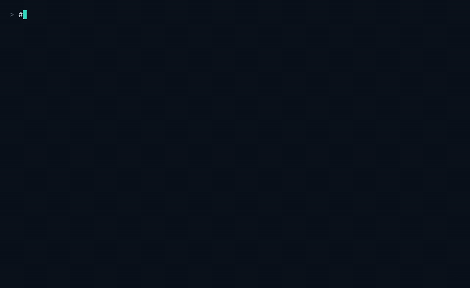

# NetGuard

**A containerized network-security monitoring platform whose detection rate is a measured number, not a claim.**

[](https://github.com/nemuel-nuhyel/netguard/actions/workflows/ci.yml)


NetGuard is a full Suricata IDS lab — WireGuard ingress, segmented Docker networks, Loki/Prometheus/Grafana observability  built around the one thing most IDS projects skip: **proving the detection works.**

A dashboard lighting up is not evidence. So NetGuard launches a labeled catalogue of fourteen traffic patterns at a monitored target  ten real attack techniques mapped to MITRE ATT&CK, four benign controls designed to look like attacks joins the alerts Suricata actually produced back against that catalogue, and prints a **scorecard**: recall, precision, false positives and mean-time-to-detect, stamped with the exact content hash of the ruleset that produced them. CI re-runs the whole thing on every pull request and fails the build if the number moves the wrong way.

**Stack:** Docker Compose · WireGuard · Suricata 7 · Emerging Threats Open · Loki · Promtail · Prometheus · Grafana · GitHub Actions

---

## Live demo

One command launches the attack catalogue, scores it, and gates it against the committed baseline:

[](docs/demo.mp4)

**[Watch or download the full-resolution MP4](docs/demo.mp4)** · [View the VHS tape](docs/demo.tape)

*Real terminal capture — the running stack, the quarantined liveness rules, a full catalogue run scoring 9/10, and the scorer's self-test. Recorded with [VHS](https://github.com/charmbracelet/vhs) from [`docs/demo.tape`](docs/demo.tape), which drives the real commands against the real stack.*

## The result

Latest scored run  and the same catalogue is re-run and re-scored on a GitHub Actions runner for every pull request:

| Metric | Value | |
|---|---|---|
| **Recall** | **9 / 10** | attack techniques detected |
| **Precision** | **1.00** | 55 true-positive alerts, zero false |
| **False positives** | **0** | across four benign controls built to bait the ruleset |
| **MTTD** | **0.023 s** | median, technique launch → first alert |
| **Ruleset** | `ET-Open/suricata-7.0.7/2026-08-17` | 52,328 rules, sha256 `8d8f599f…`, pinned in `eval/ruleset.lock` |

```
ID   TECHNIQUE                     ATT&CK      RESULT
A01  SYN port scan                 T1046       DETECTED
A02  Service/version scan          T1046       DETECTED
A03  Directory enumeration         T1083       DETECTED
A04  SQL injection                 T1190       DETECTED
A05  Reflected XSS                 T1059       DETECTED
A06  Command injection             T1190       DETECTED
A07  HTTP auth brute force         T1110       DETECTED
A08  DNS tunneling                 T1071.004   missed      ← out of capture scope, by design
A09  C2 beaconing                  T1071       DETECTED    ← author-written rule
A10  Exfiltration over HTTP        T1048       DETECTED    ← author-written rule
N01  Legitimate admin login        —           clean
N02  Large legitimate download     —           clean
N03  Rapid API polling             —           clean
N04  Many distinct DNS lookups     —           clean
```

**A08 is reported as a miss, not quietly dropped.** It is not a ruleset gap: the simulator's DNS resolution never traverses the monitored app's network namespace, and a namespace-scoped sensor cannot inspect traffic that never reaches the asset it protects. That is a stated consequence of [ADR-001](#adr-001--namespace-shared-capture), excluded from the recall target explicitly rather than silently.

The four negative controls exist to catch the opposite failure. Each deliberately resembles the attack beside it — a single valid admin login against the brute-force rules, a large legitimate download against the exfiltration rule, twenty rapid API polls against the scan rules, ten real DNS lookups against the tunneling rules. All four stayed clean, which is what makes the precision figure worth reading.

---

## Architecture

```
        ┌──────────────── netguard-lab · 10.10.0.0/24 ─────────────────┐
        │                                                              │
  ┌───────────┐      ┌──────────────┐         ┌──────────────────┐     │
  │ traffic-  │─────▶│ monitored-   │◀────────│   attack-sim     │     │
  │ generator │      │ app (nginx)  │         │ profile: attack  │     │
  │ .30       │      │ .20          │         │ .40              │     │
  └───────────┘      └──────┬───────┘         └──────────────────┘     │
                            │ shared network namespace                 │
                     ┌──────┴───────┐                                  │
                     │  Suricata 7  │ ET Open + local.rules + demo.rules│
                     │  eve.json    │ HOME_NET = 10.10.0.20/32          │
                     └──────┬───────┘                                  │
        └───────────────────┼──────────────────────────────────────────┘
                            │ suricata-logs volume
        ┌───────────────────┼───── netguard-monitor · 10.60.0.0/24 ────┐
        │  Promtail ──▶ Loki ──▶ Grafana ◀── Prometheus ◀─ cAdvisor    │
        │                          ▲                        (opt-in)   │
        └──────────────────────────┼───────────────────────────────────┘
                                   │ netguard-mgmt · 10.50.0.0/24
                          ┌────────┴────────┐
                          │ WireGuard 51820 │  operator ingress
                          └─────────────────┘
```

**Capture.** Suricata joins the monitored app's network namespace (`network_mode: service:monitored-app`) and inspects its `eth0`. It therefore sees exactly the traffic reaching the protected asset, identically on Linux, Windows and macOS  no host-mode caveats. `HOME_NET` is scoped to a single address, `10.10.0.20/32`, which is the detail that makes the whole thing work: the in-lab attacker falls into `EXTERNAL_NET`, so Emerging Threats' `$EXTERNAL_NET → $HTTP_SERVERS` rules — the bulk of its web coverage — fire against it exactly as they would against an internet-borne attacker.

**Segmentation.** Three bridge networks with static addressing, and the isolation is structural rather than advisory:

| Network | Plane | Members |
|---|---|---|
| `netguard-lab` | Attacker-controlled data plane | monitored-app, traffic-generator, attack-sim, Suricata (shared netns) |
| `netguard-monitor` | Observability | Loki, Promtail, Prometheus, Grafana, cAdvisor (opt-in) |
| `netguard-mgmt` | Operator ingress | WireGuard gateway, Grafana |

The attack simulator is attached to `netguard-lab` only. It has no route to the monitoring plane it cannot reach the evidence of its own activity.

**Data path.** The traffic generator emits benign HTTP/DNS/TCP probes on a ten-second loop. Under `profile: attack`, the simulator launches the catalogue from `10.10.0.40`. Suricata writes structured events to `eve.json` in a shared volume; Promtail tails it and parses `event_type`, `src_ip`, `dest_ip`, `dest_port`, `proto` and severity into Loki; Grafana renders alert, HTTP, DNS and severity panels over Loki, and container CPU/memory plus scrape health over Prometheus. Prometheus additionally evaluates alert rules for Loki ingestion rejection and filesystem pressure a monitoring platform that goes blind under load should say so.

---

## Quick start

Docker Engine with Compose v2 is the only hard requirement. Python is optional; the scorer falls back to a throwaway container.

```sh
cp .env.example .env          # set a unique GRAFANA_ADMIN_PASSWORD (16+ chars)

# Bring up the lab plane — fetches and content-pins ET Open, starts capture
docker compose up -d --build suricata traffic-generator

# Launch the catalogue and score it against the committed baseline
SCENARIO=all ./scripts/run-catalogue.sh
```

That writes `runs/<timestamp>/{manifest.json, eve.json, scorecard.json}` and prints the table above roughly ten minutes from `git clone` to reading your own score.

`docker compose up` on its own stays **benign**: the attack simulator is profile-gated and never starts unless you ask for it. Run a subset with `SCENARIO=A01,A04,A09`.

Verify the scoring logic with no stack running at all, over committed fixtures:

```sh
python -m unittest tests.test_scorer -v      # 14 tests
```

Grafana is on `http://127.0.0.1:3000` locally, or `http://10.50.0.20:3000` for WireGuard peers. Prometheus stays loopback-only on `:9090`. Tear down with `docker compose down`, or `down -v` to drop the volumes.

---

## How detection is measured

### The catalogue is the test spec

`services/attack-sim/catalogue.py` defines fourteen entries. Each pairs a technique with its ATT&CK mapping, the driver that produces the traffic, and a matcher describing what a competent ruleset is *expected* to fire  a set of signature substrings and Suricata classtypes.

| ID | Technique | ATT&CK | Driver |
|---|---|---|---|
| A01 | SYN port scan | T1046 | `nmap -sS`, falling back to `-sT` without `CAP_NET_RAW` |
| A02 | Service/version scan | T1046 | `nmap -sV` |
| A03 | Directory enumeration | T1083 | 15 common paths under a `gobuster/3.6` user agent |
| A04 | SQL injection | T1190 | raw-socket driver — `UNION SELECT`, `OR '1'='1`, `DROP TABLE` |
| A05 | Reflected XSS | T1059 | raw-socket driver — `<script>`, `onerror=`, `javascript:` |
| A06 | Command injection | T1190 | raw-socket driver — `;cat /etc/passwd`, `` `whoami` ``, `$(/bin/sh -c id)` |
| A07 | HTTP auth brute force | T1110 | 40 rapid credential POSTs |
| A08 | DNS tunneling | T1071.004 | 30 base32 long-label lookups |
| A09 | C2 beaconing | T1071 | 20 check-ins at a fixed one-second cadence |
| A10 | Exfiltration over HTTP | T1048 | a single 2 MiB POST body |
| N01 | Legitimate admin login | control | one well-formed login |
| N02 | Large legitimate download | control | one large ranged GET |
| N03 | Rapid API polling | control | 20 polls of a single endpoint |
| N04 | Many distinct DNS lookups | control | 10 real short-label hosts |

Injection payloads go out over a **raw socket**, not `urllib`. A URL library percent-encodes or rejects the quotes, angle brackets, pipes and semicolons that make a payload recognizable, and an encoded payload poses a different signature-matching problem than the one a real scanner presents. The driver puts the bytes on the wire the way a scanner does, which is what ET's `http.uri` rules are written to inspect.

Nothing here is a working exploit. The nginx target is unmodified and every payload is a detection trigger — an attack *shape*, not an intrusion.

### The scorer

Each run stamps every technique's real start and end wall-clock window into `manifest.json`. `netguard/scorer.py` joins that manifest against `eve.json` and computes:

```
recall     = attack techniques detected / attack techniques launched
precision  = true-positive alerts / (true positives + false positives)
fp_count   = alerts fired inside a negative-control window
MTTD       = median seconds from technique start to its first alert
```

Three properties make the number trustworthy rather than merely produced.

**Attribution by source IP, not just time.** The traffic generator runs continuously throughout every scored run. Joining on time windows alone would smear its alerts across every technique. The scorer counts only alerts whose `src_ip` is the simulator's, and honours each entry's destination too.

**A dead capture cannot pass.** If Suricata captured nothing, the scorer refuses to emit a score at all — it returns `INVALID_RUN` and exits non-zero. A broken pipeline and a ruleset that misses everything would both read as "0/10", and they are entirely different failures. Liveness is proven independently, by demo-sid alerts or any non-`stats` event inside the run window.

**Liveness rules are excluded structurally.** Four deliberately trivial rules (sids `1000001`–`1000004`) match the built-in traffic generator's own user agent, `/admin` probe, `example.com` lookup and port-8080 probe. They prove the capture → alert → Loki → Grafana path is alive. They live in `demo.rules`, the scorer excludes those sids from every metric, and `scripts/check-demo-rules.sh` fails CI if one ever migrates into `local.rules` or drifts out of sync with the scorer's exclusion list. Pipeline liveness and detection capability are measured separately because they are different things.

The scoring logic is pure over parsed inputs, so all fourteen unit tests — including the `INVALID_RUN` path run in milliseconds with no Docker at all.

### Three rule layers

| Layer | Source | Role |
|---|---|---|
| `suricata.rules` | Emerging Threats Open, fetched and content-pinned by `scripts/update-rules.sh` | Broad, real-world coverage |
| `local.rules` | Two author-written rules | Close gaps the scorecard *measured* |
| `demo.rules` | Four liveness rules | Pipeline proof only — never scored |

ET Open carries no semantic version, so it is pinned by **content**: every fetch records the exact sha256, rule count and date into `eval/ruleset.lock`, and each scorecard carries that string. `VERIFY=1` hard-fails a fetch that drifts from the committed pin.

The two author rules were written only after the scorecard showed ET Open missing A09 and A10 on its own, and each matches a **generalizable** trait rather than the simulator's fingerprints:

```suricata
# A09 — C2 beaconing (T1071): a decade-obsolete user agent at a check-in rate.
alert http $EXTERNAL_NET any -> $HTTP_SERVERS any (
  msg:"NETGUARD LOCAL C2 beacon heuristic - repeated legacy MSIE6 user-agent";
  flow:established,to_server; http.user_agent; content:"MSIE 6.0"; nocase;
  detection_filter:track by_src, count 5, seconds 30;
  classtype:trojan-activity; sid:1000010; rev:1;)

# A10 — Exfiltration over HTTP (T1048): a seven-digit inbound Content-Length.
alert http $EXTERNAL_NET any -> $HTTP_SERVERS any (
  msg:"NETGUARD LOCAL large outbound POST - possible exfiltration";
  flow:established,to_server; http.method; content:"POST";
  http.header; pcre:"/^Content-Length\x3a\s*\d{7,}/mi";
  classtype:policy-violation; sid:1000020; rev:1;)
```

Neither matches the `/beacon` or `/upload` path the simulator happens to use. A rule that matches its own test harness proves nothing; both of these would fire on traffic the simulator never sent. The `detection_filter` on sid 1000010 is what separates a beacon from a single request, and the `Content-Length` bound on sid 1000020 is why N02  a large legitimate *download*, a big response rather than a big request body  stays clean.

### The baseline gate

`eval/baseline.json` commits the protected floor: **recall ≥ 0.9 and false positives ≤ 0**. The scorer exits non-zero when a run falls below it, which fails CI. Improving detection means bumping the baseline *in the same commit as the rule change*, so every movement in the headline metric is a reviewable diff. Detection cannot drift silently in either direction.

---

## CI/CD and DevSecOps

`.github/workflows/ci.yml` — seven jobs:

| Job | Gate |
|---|---|
| **validate** | `docker compose config`, ruff, yamllint, shellcheck, three repository guards, plus real config validation of Loki (`-verify-config`) and Prometheus (`promtool check config`) |
| **secrets** | gitleaks across full git history |
| **unit** | 14 scorer tests |
| **rules** | `suricata -T` compiles `local.rules` and `demo.rules` |
| **sast** | Semgrep `p/python` + `p/security-audit`, no ERROR severity |
| **containers** | Trivy filesystem scan — vuln, secret and misconfig, no CRITICAL |
| **detection** *(pull requests)* | brings the stack up, waits for a proven-live capture, runs the catalogue, **fails if recall drops or false positives rise**, and uploads the scorecard as an artifact |

The detection job is the one that matters. It is a genuine integration test: a hosted runner builds the stack from scratch, waits up to five minutes for demo-sid alerts to prove the capture is alive, launches all fourteen techniques, and gates the result. A pull request that weakens a rule fails automatically, with the scorecard attached to the run.

Three purpose-built guards run in both CI and pre-commit, each protecting an invariant that would otherwise decay quietly:

- **`check-gitignore.sh`** — asserts that eighteen key config and source files are *not* ignored, and that secrets and runtime data *are*. A blanket wildcard can silently swallow a config-centric project; this makes that failure loud.
- **`check-demo-rules.sh`** — asserts the liveness sids stay isolated in `demo.rules` and in sync with the scorer's exclusion list.
- **`check-hardening.sh`** — asserts loopback-only publication, the Grafana Docker secret, no floating image tags, the WireGuard digest pin, and Loki retention and limits.

Install the local mirror with `pipx install pre-commit && pre-commit install`. Every pull request also carries a template requiring a detection-impact statement.

---

## Security posture

**Secrets.** No secret is in the tree or in git history — verified with gitleaks over the full history, enforced on every commit and every push. WireGuard keys are generated at runtime into a Docker volume. Grafana's admin password arrives as a Compose secret sourced from the environment, so it appears neither in the container's environment nor in `docker inspect`, and a wrapper entrypoint refuses to start on a password under 16 characters or on the published example value. Failing closed on a weak credential beats logging a warning nobody reads.

**Exposure.** Prometheus and Grafana publish on `127.0.0.1` only, never the LAN. Operator access is through the WireGuard tunnel to Grafana's private management address, or an SSH forward.

**Supply chain.** Every image is pinned. The WireGuard container — the one holding `NET_ADMIN` and `SYS_MODULE` is pinned by **digest**, because a floating tag under host-network capabilities is the worst possible place to accept drift. Trivy scans in CI.

**Blast radius.** cAdvisor requires `privileged` and a host-root mount, so it is profile-gated, off by default, mounted read-only, and documented as an accepted isolated risk rather than buried in a service list.

**Log-pipeline integrity.** Loki has seven-day retention and bounded ingestion; Prometheus alerts on discarded samples and on filesystem pressure. An attacker who floods alerts to bury a real one degrades precision  and the scorecard measures precision, so noise lowers the score rather than inflating it.

### Threat model

Two directions, because a monitoring platform has two.

**Adversary A  the intruder NetGuard must detect.** Modeled on ATT&CK, and every row is a measured catalogue entry rather than an assumption:

| Tactic | Behaviour | Catalogue | Result |
|---|---|---|---|
| Reconnaissance | Port and service scanning | A01, A02 | ✅ ET SCAN |
| Initial Access | Path and vhost enumeration | A03 | ✅ ET WEB_SERVER |
| Execution / Exploit | SQLi, XSS, command injection | A04–A06 | ✅ ET WEB_SPECIFIC / WEB_SERVER |
| Credential Access | HTTP auth brute force | A07 | ✅ ET brute-force |
| Command & Control | DNS tunneling, periodic beaconing | A08, A09 | A08 ✗ (capture scope) · A09 ✅ author rule |
| Exfiltration | Large outbound transfer | A10 | ✅ author rule |

**Adversary B — attacks against NetGuard itself.** Every packet the platform ingests is attacker-authored by definition, and Suricata parses them:

| Threat | Control |
|---|---|
| Evasion via fragmentation or obfuscation | Stream reassembly tuned; ET normalization; measured through the catalogue |
| Alert flooding to bury a real detection | Precision is a scored metric, so noise costs score |
| Log-pipeline DoS | Loki retention and ingestion limits; Prometheus rejection and disk-pressure alerts |
| Monitoring-plane exposure | Loopback-only binds, Grafana secret, CI hardening guard |
| Privileged-container escape | cAdvisor opt-in, read-only, documented blast radius |
| Supply-chain drift | Digest pin on the privileged image, content hash on the ruleset, Trivy |
| Secret leakage | Narrowed ignore rules, gitleaks in CI and pre-commit, clean history |
| **Measurement tampering** | Liveness sids quarantined and excluded by construction, guarded in CI |

That last row is the one specific to this project: the integrity of the number is itself an asset worth defending.

**Enforced invariants.** Each has a check that fails loudly:

1. The attack simulator reaches `netguard-lab` only — enforced by network attachment.
2. No image runs on a floating tag; the privileged image is digest-pinned — `check-hardening.sh`.
3. No secret in the tracked tree or history — gitleaks, `check-gitignore.sh`.
4. Every detection claim traces to a scored run at a named ruleset version — the scorecard stamps `ruleset.lock`, and CI re-runs it.
5. No liveness signature is ever counted as detection — `check-demo-rules.sh`.
6. No monitoring service publishes on a non-loopback interface — `check-hardening.sh`.

---

## Design decisions

### <a id="adr-001"></a>ADR-001 — Namespace-shared capture

**Context.** `network_mode: host` with `-i any` captures the Docker Desktop backing VM's interfaces rather than the lab bridge, so host-mode capture sees nothing relevant on Windows or macOS.

**Decision.** Run Suricata inside the monitored app's network namespace and inspect its `eth0`.

**Consequences.** Capture behaves identically across Linux, Windows and macOS, and the sensor is scoped to the asset it protects the correct scope for a single-target lab. The accepted trade-off is that traffic never reaching the monitored app, such as DNS to the resolver, is out of view; this is why A08 is a documented miss. Multi-target capture remains an option for a Linux-host deployment.

### <a id="adr-002"></a>ADR-002 — ET Open alongside author rules

**Context.** A hand-written rule file cannot approach real-world coverage, and a lab that only detects what its author thought to write is not measuring anything.

**Decision.** Manage ET Open with `suricata-update`, pinned by content hash; keep a small `local.rules` for gaps the scorecard identifies.

**Consequences.** Broad credible coverage, reproducible per run. ET Open is a rolling ruleset, so the pin is by content and the gate is not hermetic — an upstream change that drops coverage correctly fails CI until it is investigated.

### <a id="adr-003"></a>ADR-003 — Liveness rules are quarantined and never scored

**Context.** Pipeline liveness and detection capability are different properties. A rule matching the lab's own generated traffic proves the first and says nothing about the second.

**Decision.** Keep the four generator-matching sids in `demo.rules`, exclude them from every metric in the scorer, and enforce the split in CI.

**Consequences.** The score reflects only traffic the project does not control, while the smoke-test value of those rules is retained.

### <a id="adr-004"></a>ADR-004 — The scorer was built before the rules were broadened

**Context.** Adding a large ruleset, watching alerts appear and declaring success is the failure mode this project exists to avoid. Without a denominator, "more alerts" is not "better detection."

**Decision.** Build the catalogue and scorer first; measure every rule change as a delta against a committed baseline.

**Consequences.** Detection progress is a reviewable number — 0, then 7/10 with ET Open alone, then 9/10 once the two author rules closed the measured gaps — rather than an assertion.

### <a id="adr-005"></a>ADR-005 — Recall at a fixed false-positive budget is the headline

**Context.** Alert volume rewards noise, and a security tool that cries wolf gets muted.

**Decision.** Report recall together with precision and a false-positive count over labeled controls. The gate fails when false positives rise, not only when recall falls.

**Consequences.** A run firing 5,000 alerts and missing the SQLi scores worse than one firing 12 and catching everything. The negative controls make the false-positive surface explicit instead of hypothetical.

### <a id="adr-006"></a>ADR-006 — Ignore secrets by name, never by wildcard

**Context.** A blanket `*.conf` or `**/config/*` silently swallows a config-centric project the moment it grows, and inline comments on ignore lines are read literally, quietly disarming the pattern.

**Decision.** Ignore secrets by specific name and path, keep comments on their own lines, and assert in CI that key files stay tracked.

**Consequences.** Configuration stays version-controlled, secrets stay out, and the failure cannot return unnoticed.

### <a id="adr-007"></a>ADR-007 — GitHub Actions

**Decision.** Run the pipeline where the code lives.

**Consequences.** Secret scanning and the detection regression gate execute on every relevant change, which is what turns "zero secret leakage" from an aspiration into an enforced property.

### <a id="adr-008"></a>ADR-008 — Loopback publication for Prometheus and Grafana

**Context.** Binding `0.0.0.0` with weak or absent authentication exposes every metric and the admin API to anyone on the same network a café, a campus, a shared flat.

**Decision.** Bind both to `127.0.0.1` and reach them through WireGuard or an SSH forward. Move Grafana's admin password to a Docker secret.

**Consequences.** Host ports stay off the LAN. VPN peers use Grafana's private management address; direct Prometheus access requires local access or a tunnel.

### <a id="adr-009"></a>ADR-009 — The simulator is profile-gated and lab-only

**Decision.** `profiles: [attack]`, and attachment to `netguard-lab` alone.

**Consequences.** The default stack is benign and safe to leave running, and the simulator has no route to the monitoring plane — so invariant 1 holds by construction rather than by policy.

---

## Limitations

Stated plainly, because a measurement without its bounds is marketing:

- **The catalogue is fixed and known; real attackers improvise.** Recall against it is an upper bound on real-world recall, not an estimate of it.
- **Capture is scoped to the monitored asset.** Traffic that never reaches it is invisible by design which is precisely what A08 demonstrates.
- **ET Open is a subset of ET Pro.** Some techniques it misses would be caught by the paid ruleset.
- **A single-target lab has neither production base rates nor production traffic mix**, so the precision figure is optimistic.
- **The pin is by content, not by version, and CI re-fetches.** An upstream ruleset change that reduces coverage fails the gate until it is investigated or re-pinned: reproducible, but not hermetic.
- **This is a lab, not a production deployment.** Non-local use would need authenticated ingress, backups, notification delivery and broader operational monitoring.

---

## Repository layout

```
docker-compose.yml           # 11 services, 3 networks, static addressing
services/
  suricata/                  # suricata.yaml (HOME_NET=/32) + rules/{local,demo}.rules
  attack-sim/                # catalogue.py + run_catalogue.py — profile-gated
  traffic-generator/         # benign liveness traffic
netguard/scorer.py           # manifest × eve.json → scorecard, INVALID_RUN guard
eval/
  baseline.json              # the committed floor the CI gate protects
  ruleset.lock               # ET Open content pin: sha256, rule count, date
scripts/
  run-catalogue.sh           # launch + score, one command
  ci-detection.sh            # the CI regression gate
  update-rules.sh            # fetch + content-pin ET Open
  check-{gitignore,demo-rules,hardening}.sh
monitoring/                  # loki · promtail · prometheus (+ alert rules) · grafana
tests/                       # 14 scorer tests + fixtures
docs/                        # demo.gif · demo.mp4 · demo.tape
.github/workflows/ci.yml     # 7 jobs
```


---

Built by [Nuhyel Nemuel Laushi](https://github.com/nemuel-nuhyel).
